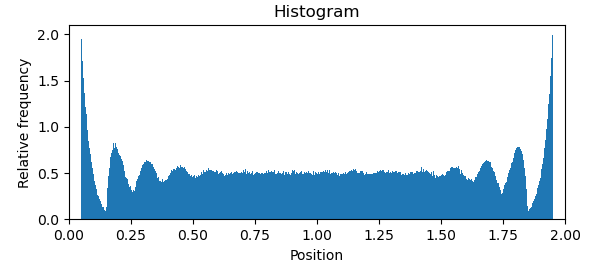

# Clothes pin probability distribution
## Introduction
$N$ clothes pins with a width of $2\sigma$, a string of length $L$. The clothes pins can not overlap and must be uniformly distributed over the string.

## Objective
Obtain the aproximate probability distribution of clothes pin positions in the ensemble of valid configurations.

## Theoretical result
The goal distribution should look like the following:

## My solution
I start placing the clothes pins evenly spaced along the string. Then move one by one every clothes pin a distance between their adjacent clothes pin and make them bounce if they colide.

